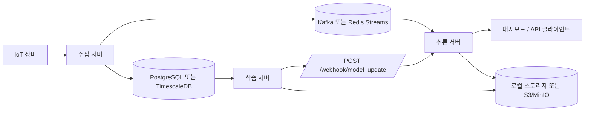

# 시스템 분리 계획서

## 목적

현재 `fastapi` 애플리케이션은 하나의 FastAPI 서버 안에서 다음 책임을 함께 수행하고 있다.

- 센서 데이터 조회/처리
- 실시간 전력 예측
- 피처 예측
- 대시보드 응답 조합
- MILP 최적화
- 모델 메타 조회 및 캐시 리로드
- 정적 웹 페이지 제공

이 문서는 현재 구조를 기준으로, 향후 `수집 서버`, `추론 서버`, `학습 서버`로 점진 분리하기 위한 기준 문서다.

## 목표 구조



## 서버별 책임 분리

### 1. 수집 서버

역할:
- IoT 장비 또는 외부 시스템에서 들어오는 원본 센서 데이터를 수신
- 받은 데이터를 메시지 큐로 즉시 발행
- 원본 데이터를 DB에 저장

담당 기능:
- 센서 수신 API
- 센서 배치 적재
- 큐 publish
- DB insert

비담당 기능:
- 예측
- MILP
- 모델 로딩

### 2. 추론 서버

역할:
- 최신 모델을 메모리에 적재하고 실시간 예측 제공
- 대시보드용 응답 조합
- 모델 리로드 처리

담당 기능:
- 전력 예측 API
- 피처 예측 API
- 대시보드 API
- 모델 메타 조회
- 모델 캐시 리로드
- 큐 consume 기반 최신 상태 유지

비담당 기능:
- 모델 학습
- 원본 센서 대량 적재

### 3. 학습 서버

역할:
- 최근 기간 데이터를 배치 조회하여 모델 학습
- 학습 완료 모델을 registry에 업로드
- 추론 서버에 모델 갱신 알림 전송

담당 기능:
- 학습 잡 실행
- 모델 산출물 저장
- 메타데이터 생성
- webhook 호출

비담당 기능:
- 실시간 API 응답
- 센서 수집

## 현재 코드의 TO-BE 배치

| 현재 파일/영역 | 현재 역할 | TO-BE 소속 |
|---|---|---|
| `fastapi/main.py` | 전체 앱 진입점, 라우터 등록, 정적 웹 서빙, 스케줄러 기동 | 서버별 entrypoint로 분리 |
| `fastapi/api/routers/predict_router.py` | 전력/피처 예측 API | 추론 서버 |
| `fastapi/api/routers/model_router.py` | 모델 메타, 캐시 리로드 API | 추론 서버 |
| `fastapi/api/routers/monitoring_router.py` | 대시보드/운영 통계 API | 추론 서버 |
| `fastapi/api/routers/optimize_router.py` | MILP API | 당장은 기존 앱 유지, 이후 별도 최적화 서버 검토 |
| `fastapi/api/routers/simulate_router.py` | 시뮬레이션 API | 추론 서버 또는 별도 운영 도구 |
| `fastapi/service/prediction_service.py` | 전력 예측 orchestration | 추론 서버 |
| `fastapi/service/model_store.py` | 모델 로딩, 전처리, 추론 엔진 | 추론 서버 |
| `fastapi/service/feature_prediction_service.py` | 피처 예측 | 추론 서버 |
| `fastapi/service/dashboard_service.py` | 대시보드 응답 조합 | 추론 서버 |
| `fastapi/service/monitoring_service.py` | API 운영 통계 집계 | 추론 서버 |
| `fastapi/service/optimization_service.py` | MILP, threshold, 예측 기반 분산 계획 | 추론 서버 옆 유지 후 추후 분리 |
| `fastapi/service/processing/*` | DB 조회/전처리 유틸 | 공통 모듈 또는 추론 서버 내부 |
| `fastapi/scheduler/sensor/*` | 센서 스케줄 기반 처리 | 수집 서버 |
| `fastapi/scheduler/EW/*` | EW 스케줄 처리 | 수집 서버 또는 별도 배치 |
| `fastapi/ai_models/current/*` | 전력 예측 모델 파일 | 모델 registry 또는 추론 서버 마운트 |
| `fastapi/ai_models/feature_model/*` | 피처 예측 모델 파일 | 모델 registry 또는 추론 서버 마운트 |
| `fastapi/web/*` | HTML 대시보드/시뮬레이션 페이지 | 별도 프론트 또는 추론 서버 정적 서빙 |

## 권장 분리 순서

### Phase 1. 추론 서버 분리

이유:
- 현재 코드에서 가장 경계가 명확하다.
- `prediction_service`, `feature_prediction_service`, `model_store`가 이미 하나의 역할로 묶여 있다.

범위:
- 전력 예측 API
- 피처 예측 API
- 대시보드 API
- 모델 메타/리로드 API

성공 기준:
- 기존 `/api/predict/*`, `/api/monitor/*`, `/api/model-info/*`, `/api/reload-models` 동작 유지
- 모델을 재시작 없이 다시 읽을 수 있음

### Phase 2. 수집 서버 분리

이유:
- 실시간 수집 트래픽과 예측 API 부하를 분리할 수 있다.

범위:
- 센서 입력 수집
- DB 저장
- 메시지 큐 publish
- 기존 스케줄러 정리

성공 기준:
- 수집 서버 장애가 추론 API 응답 지연으로 바로 이어지지 않음
- 센서 데이터가 DB와 MQ로 동시에 전달됨

### Phase 3. 학습 서버 분리

이유:
- 학습은 가장 무겁고 실행 주기가 길어 운영 API와 분리 효과가 크다.

범위:
- DB batch 조회
- 학습 실행
- 모델 파일 업로드
- 추론 서버 webhook 호출

성공 기준:
- 새 모델 산출 후 추론 서버가 무중단으로 최신 모델 사용

## 통신 계약 초안

### 수집 서버 -> 메시지 큐

권장 메시지 예시:

```json
{
  "device_id": "10020b75-e523-45b8-8905-4763865d6e19",
  "timestamp": "2026-04-15T10:12:00+09:00",
  "values": {
    "CUR_VOLTAGE": 14653.2,
    "PRESSURE": 5.3,
    "TEMPERATURE": 78.1,
    "HZ": 30.0,
    "AVGCURRENT": 14.2,
    "AVGVOLTAGE": 394.8,
    "FACTOR": 0.98
  }
}
```

### 학습 서버 -> 추론 서버 webhook

권장 payload 예시:

```json
{
  "model_family": "current_power",
  "version": "2026-04-15T02-00-00Z",
  "registry_path": "s3://bucket/models/current/2026-04-15T02-00-00Z/"
}
```

## 공통 모듈 후보

분리 전에 먼저 공통화하면 좋은 영역:

- 모델 입력 alias/정규화 유틸
- DB 세션/조회 유틸
- 메시지 스키마 정의
- 모델 registry 경로 규칙
- 환경변수 로더

추천 디렉터리 예시:

```text
shared/
  config.py
  schemas.py
  db.py
  model_registry.py
  preprocessing.py
```

## 현재 시점 의사결정 포인트

초기에 결정이 필요한 항목:

1. 메시지 브로커를 `Kafka`로 갈지 `Redis Streams`로 갈지
2. 모델 저장소를 `로컬 볼륨`으로 시작할지 `MinIO/S3`로 갈지
3. MILP를 추론 서버 안에 둘지, 이후 별도 서버로 뺄지
4. 웹 페이지를 FastAPI 정적 파일로 유지할지, 프론트엔드를 분리할지

## 현실적인 1차 권장안

초기 구현 리스크를 낮추려면 다음 구성이 현실적이다.

- 메시지 브로커: `Redis Streams`
- DB: `PostgreSQL` 또는 `TimescaleDB`
- 모델 저장소: 처음엔 로컬 마운트, 이후 `MinIO/S3` 확장
- 분리 순서: `추론 서버 -> 수집 서버 -> 학습 서버`
- MILP: 당장은 현재 앱 내부 유지

## 다음 작업 제안

이 문서를 기준으로 다음 단계는 아래 순서가 가장 자연스럽다.

1. 서버별 디렉터리 초안 만들기
2. 추론 서버에서 사용할 공통 모듈 경계 정리
3. 현재 라우터/서비스를 새 구조에 맞춰 파일 단위로 이동 계획 수립
4. `docker-compose` 초안에 `db`, `broker`, `inference`, `ingestion`, `trainer` 서비스 추가
